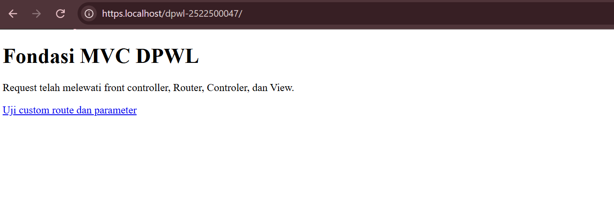
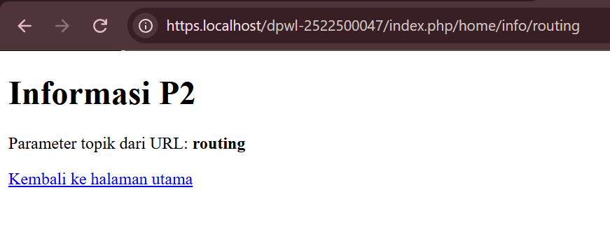

## 1. Tujuan Praktikum 
[Tujuan P2 untuk mencegah terjadinya masalah atau bahaya serta mengurangi dampaknya agar lingkungan menjadi lebih aman,tertib,dan nyaman.] 

## 2. Struktur Direktori
dpwl-nim/
│
├── application/
│   ├── config/
│   │   ├── config.php       → Mengatur konfigurasi aplikasi.
│   │   └── routes.php       → Mengatur pemetaan URL ke Controller.
│   │
│   ├── controllers/
│   │   └── Home.php         → Menangani request dan menentukan View.
│   │
│   ├── helpers/
│   │   └── url_helper.php   → Membantu membuat URL aplikasi dan aset.
│   │
│   └── views/
│       └── home/
│           ├── index.php    → Menampilkan halaman utama.
│           └── info.php     → Menampilkan informasi/parameter.
│
├── assets/
│   └── css/
│       └── app.css          → Mengatur tampilan/style halaman.
│
├── system/
│   └── core/
│       ├── Controller.php   → Base Controller untuk fungsi umum.
│       └── Router.php       → Mengatur route dan memanggil Controller.
│
└── index.php                → Pintu masuk utama (Front Controller).

  
## 3. Front controller 
  [index.php berperan sebagai satu titik masuk utama aplikasi,sebagai pintu utama aplikasi yang menerima request, menyiapkan kebutuhan aplikasi, lalu meneruskannya ke Router agar request dapat diproses oleh Controller yang sesuai.] 

## 4.  Routing dan Pemetaan URL | URL/Route | Controller | Method | Parameter | View | |---|---|---|---|---| | / | Home | index | - | home/index.php | | home/index | Home | index | - | home/index.php | | home/info/mvc | Home | info | mvc | home/info.php | | info/routing | Home | info | routing | home/info.php |  

Tambahkan satu baris untuk route hasil Tahap Modifikasi ATM yang dibuat berdasarkan objek atau konteks aplikasi DPW, kemudian jelaskan pemetaan route → Controller → method → parameter → View. 

| URL/Route             | Controller | Method | Parameter | View             |
| --------------------- | ---------- | ------ | --------- | ---------------- |
| `/`                   | Home       | index  | -         | home/index.php   |
| `home/index`          | Home       | index  | -         | home/index.php   |
| `home/info/mvc`       | Home       | info   | mvc       | home/info.php    |
| `info/routing`        | Home       | info   | routing   | home/info.php    |
| `mobil/detail/avanza` | Mobil      | detail | avanza    | mobil/detail.php |

mobil/detail/avanza
        ↓
     Mobil
        ↓
     detail()
        ↓
   parameter: avanza
        ↓
mobil/detail.php

Artinya, ketika pengguna mengakses mobil/detail/avanza, Router akan mengarahkannya ke Controller Mobil, kemudian menjalankan method detail() dengan parameter avanza. Selanjutnya Controller memilih View mobil/detail.php untuk menampilkan informasi mobil tersebut.
 
## 5. Base URL dan Helper Jelaskan fungsi base_url() dan site_url(), kemudian berikan contoh penggunaannya pada implementasi P2:  - base_url() untuk memanggil assets/css/app.css;  - site_url() untuk membentuk URL navigasi/route aplikasi.  

base_url() digunakan untuk membuat alamat dasar aplikasi dan biasanya digunakan untuk memanggil file aset, seperti CSS.

Contoh:
<link rel="stylesheet" href="<?= base_url('assets/css/app.css') ?>">
Hasilnya:
http://localhost/dpwl-nim/assets/css/app.css

site_url() digunakan untuk membuat URL yang mengarah ke route atau halaman aplikasi melalui index.php.

Contoh :
<a href="<?= site_url('info/routing') ?>">
    Uji Custom Route
</a>
Hasilnya : 
http://localhost/dpwl-nim/index.php/info/routing

## 6. Alur Request-response Jelaskan dua alur berikut:  1. Alur eksekusi aktual P2: Browser → index.php → Router → Controller → View → Response. 2. Posisi Model dalam arsitektur MVC lengkap: Browser → index.php → Router → Controller → Model → basis data/data → Model → Controller → View → Response.  Pada implementasi P2, Model belum digunakan kare na akses dan pengelolaan basis data mulai diimplementasikan pada P3. 
1. Alur eksekusi aktual P2
Browser → index.php → Router → Controller → View → Response

Menurut saya, saat pengguna membuka URL, Browser mengirim request ke "index.php". Kemudian request diteruskan ke Router untuk menentukan Controller dan method yang sesuai. Controller memproses data dan memilih View. Setelah itu View menghasilkan HTML yang dikirim kembali ke Browser sebagai response.
2. Alur MVC lengkap
Browser
   ↓
index.php
   ↓
Router
   ↓
Controller
   ↓
Model
   ↓
Basis Data / Data
   ↓
Model
   ↓
Controller
   ↓
View
   ↓
Response

Model berfungsi menghubungkan Controller dengan database. Controller meminta data ke Model, lalu Model mengolah data dan mengirimkannya kembali ke Controller untuk ditampilkan di View.

Pada P2, Model belum digunakan karena masih fokus pada dasar MVC, routing, Controller, dan View. Database baru digunakan pada P3.

## 7. Hasil Pengujian dan Debugging Catat skenario pengujian valid dan tidak valid beserta hasilnya. Jika ditemukan kesalahan selama implementasi, dokumentasikan sekurang-kurangnya satu proses debugging yang memuat:  Gejala → Penyebab → Perbaikan → Hasil Uji Ulang  Jika seluruh implementasi langsung berjalan sesuai hasil yang diharapkan, jelaskan hasil pemeriksaan sintaks dan pengujian yang telah dilakukan. 

Pengujian Valid :

| No. | URL/Route                 | Hasil Pengujian                                                                  |
| --- | ------------------------- | -------------------------------------------------------------------------------- |
| 1   | `/`                       | Berhasil menampilkan halaman utama melalui `Home::index()`.                      |
| 2   | `index.php/home/index`    | Berhasil memetakan URL ke `Home::index()`.                                       |
| 3   | `index.php/home/info/mvc` | Berhasil menjalankan `Home::info()` dengan parameter `mvc`.                      |
| 4   | `index.php/info/routing`  | Berhasil menjalankan custom route dan menampilkan parameter `routing` pada View. |

Pengujian Tidak Valid :

| No. | URL/Route                 | Hasil Pengujian                                                    |
| --- | ------------------------- | ------------------------------------------------------------------ |
| 1   | `index.php/tidakada`      | Gagal karena Controller tidak ditemukan dan menghasilkan HTTP 404. |
| 2   | `index.php/home/tidakada` | Gagal karena method tidak ditemukan dan menghasilkan HTTP 404.     |

Pemeriksaan Sintaks :

Pemeriksaan sintaks dilakukan menggunakan perintah `php -l` pada beberapa file utama, yaitu:

```text
php -l index.php
php -l application\config\config.php
php -l application\config\routes.php
php -l application\helpers\url_helper.php
php -l application\controllers\Home.php
php -l system\core\Controller.php
php -l system\core\Router.php
```

Hasil pemeriksaan menunjukkan **“No syntax errors detected”**, sehingga file-file tersebut tidak memiliki kesalahan sintaks PHP. Setelah itu dilakukan kembali pengujian routing untuk memastikan aplikasi berjalan sesuai dengan yang diharapkan.

Debugging :

Selama implementasi dilakukan pemeriksaan terhadap struktur folder, routing, Controller, View, Base URL, Helper, dan sintaks PHP. Jika ditemukan kesalahan, proses debugging dilakukan dengan urutan:

**Gejala → Penyebab → Perbaikan → Hasil Uji Ulang**

Dalam implementasi ini, setelah dilakukan pemeriksaan sintaks dan pengujian route valid maupun tidak valid, hasil aplikasi sudah sesuai dengan yang diharapkan.

## 8. Bukti Tangkapan Layar Sisipkan gambar yang relevan dari folder dokumentasi/ dengan perintah:  ### Gambar 1. Hasil Pengujian Halaman Utama     ### Gambar 2. Hasil Pengujian Custom Route   

## 9. Kesimpulan P2 Jelaskan apa yang sudah dapat dilakukan kerangka MVC dan apa yang baru akan ditambahkan pada P3. 
Pada P2, saya sudah memahami dasar MVC, mulai dari "index.php", Router, Controller, sampai View. 

Pada P3, aplikasi akan dikembangkan dengan menambahkan Model, koneksi database, autentikasi, session, kontrol akses, dan AdminLTE.